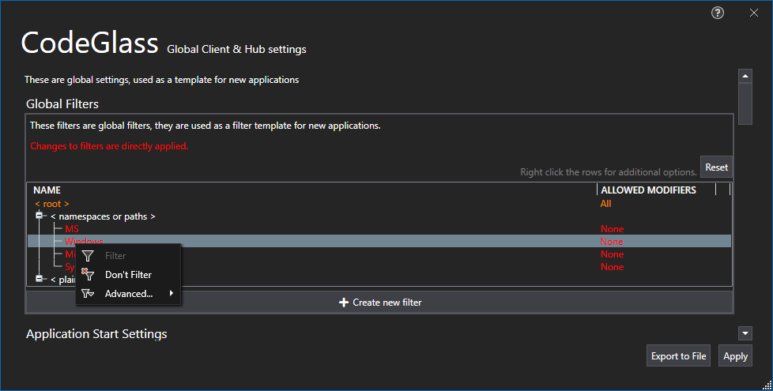
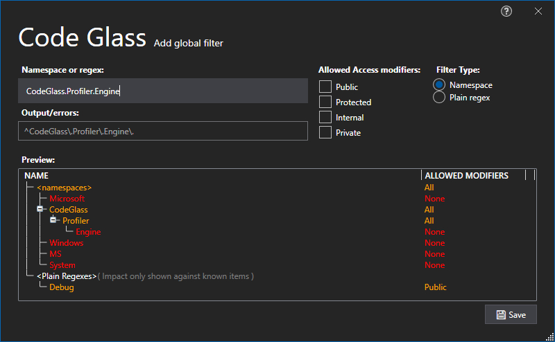

# Global Filters

In this tab you can manage your [Global filters](../../features/ProfilingDataFiltering.md#user-global-filters) that will be set as default on any new application.



See [Global filters](../../features/ProfilingDataFiltering.md#user-global-filters) for more information on the filters.

See the button descriptions below for more information

## Reset
By Pressing this button you reset the filters back to the [default filters](../../features/ProfilingDataFiltering.md#default-filters)

## Create new filter
By Pressing this button you open the Add Global Filter Window:



# Application Breadcrumbs: 
- [Splashscreen](../Splashscreen.md) / [Main Menu](../mainwindow.md) / [Client and user settings Window](../clientusersettingswindow.md)

# See Also:
 - [Client and user settings Window](../clientusersettingswindow.md)
 - [Profiler Settings Tab](profilingsettings.md)
 - [Client settings Tab](ClientSettings.md)
 - [Feature - Profiling data filtering](../../features/ProfilingDataFiltering.md)
 - [Application filters](../applicationsettingswindow/ApplicationFilters.md)
 - [Hub Settings Tab](HubSettings.md)

