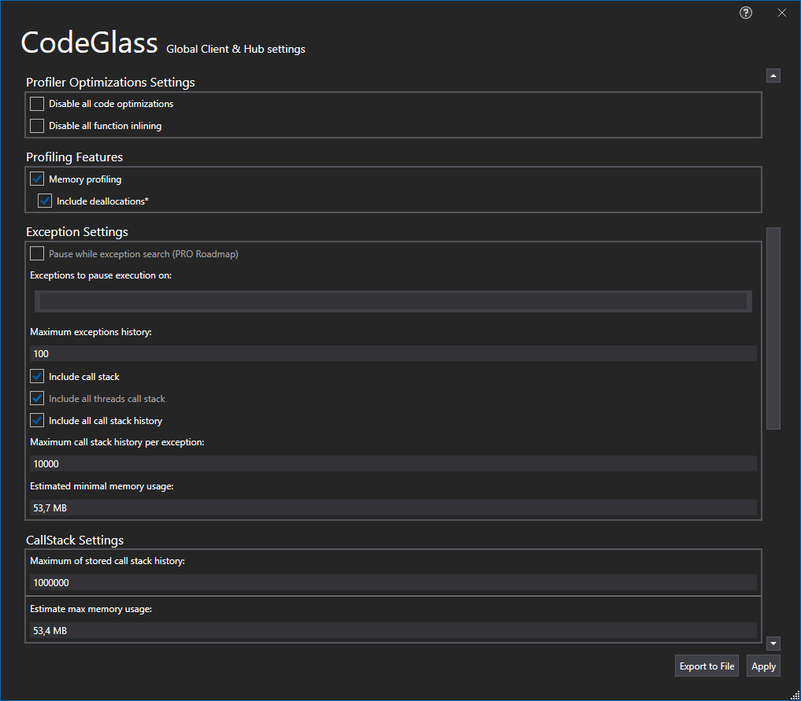

# Profiling Settings

The settings defined here are used as template for new applications, each setting is detailed below.



# Application Breadcrumbs: 
- [Splashscreen](../Splashscreen.md) / [Main Menu](../mainwindow.md) / [Client and user settings Window](../clientusersettingswindow.md)

# See Also:
 - [Client and user settings Window](../clientusersettingswindow.md)
 - [Global Filters Tab](globalfilters.md)
 - [Client setting Tas](ClientSettings.md)
