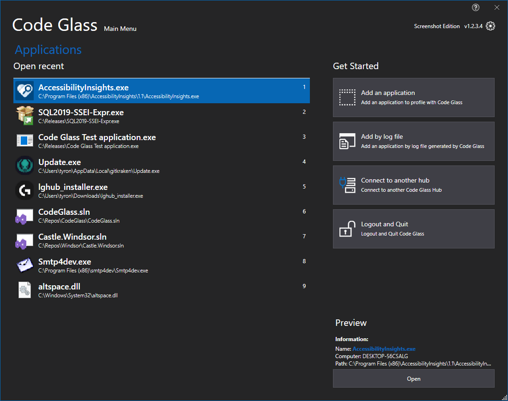

# Main Menu

The main menu is where you first land after logging in. This view has a couple of different tabs with [Applications](mainwindow/application.md) as the root tab.

You can get to the [Client and user settings](clientusersettingswindow.md) From within any tabs by clicking on the Gear Icon in the top right.

The Currently shown tab is [Applications](mainwindow/application.md) tab

## Tabs
- [Applications](mainwindow/application.md)
- [Application instances](mainwindow/applicationInstance.md)
- [New Application](mainwindow/newapplication.md)

The blue text marks the Tabs in the Top Left corner, by clicking on "Applications," you can return to the [Applications](mainwindow/application.md) tab within the other tabs views.

# Application Breadcrumbs: 
- [Splashscreen](Splashscreen.md) /

# See Also
 - [Applications](mainwindow/application.md)
 - [Application instances](mainwindow/applicationInstance.md)
 - [New Application](mainwindow/newapplication.md)
 - [Client and user settings](clientusersettingswindow.md)
 - [Application Instance Window - File Menu](ApplicationInstanceDockWindow/Menubar.md#file-menu)