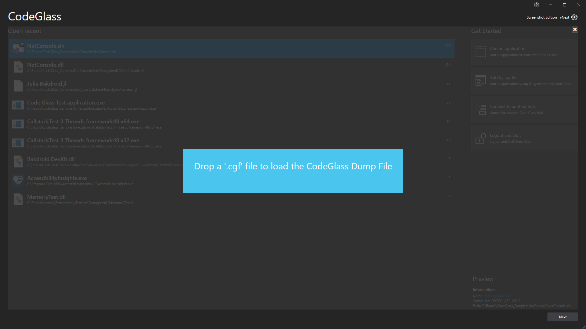

# Applications View

On this view you see all the applications that you previously added to CodeGlass. You can [open the application](applicationInstance.md) by double clicking on it or by pressing the "Next" button in the bottom right.

To add a new applications you can press the "[Add an application](newapplication.md)" button on the right. This will bring you to a new window to set everything up.

## Adding a Log File
On this window you can also add [profiling snapshots](../../features/ProfilingSnapshots.md). You can do this by pressing the "Add by log file" button, or dragging a ".cgf" file into the window.

If the application is already known to this client it will not add a new application but add a new [instance](applicationInstance.md) instead.

## Connect to Another Hub

On this window you can also connect to a [remote CodeGlass hub](../../features/CodeGlassHub.md#remote-hub) by pressing the "Connect to another hub" button.
Here you can connect to a different [CodeGlass hub](../../features/CodeGlassHub.md). After pressing the "Restart" button the application will restart and connect to the other hub.

## Logging out
You can also decide to logout and quit CodeGlass by clicking on the "Logout and Quit" button.

<!-- # Application Breadcrumbs:  -->
<!-- - [Splashscreen](../Splashscreen.md) / -->

# See Also:
 - [Main Menu](../mainwindow.md)
 - [Application instances Tab ](applicationInstance.md)
 - [New Application Tab](newapplication.md)
 - [Client and user settings](../clientusersettingswindow.md)
