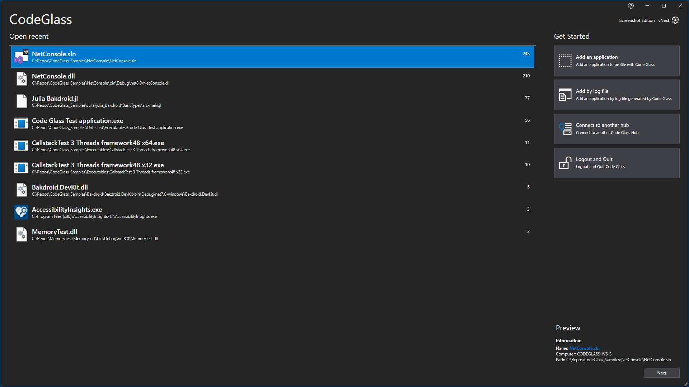

# Applications View

On this view you see all the applications that were previously added to Code Glass and you can [open them](applicationInstance.md) to start profiling them by double clicking on them or pressing the "Open" button on the bottom right.

You can add new applications by pressing the "[Add an applciation button](newapplication.md)" on the right. 

You can also add an Application by the log file you created with the [Profiling Snapshots](../../features/ProfilingSnapshots.md) by pressing the "Add by log file" button.  
If the application is already known to this client it will not add another application but an [instance](applicationInstance.md) instead

You can also connect to a [remote code glass hub](../../features/CodeGlassHu.mdb#remote-hub) by pressing the "[Connect to another hub](#connect-to-another-hub)" button.

You can also deside to logout and quit Code Glass by clicking on the "Logout and Quit" button.

## Connect to another hub

Here you can connect to a different [Code Glass Hub](../../features/CodeGlassHub.md), after pressing connect the applicaiton will restart and connect to the other hub.

# Application Breadcrumbs: 
- [Splashscreen](../Splashscreen.md) /

# See Also:
 - [Main Menu](../mainwindow.md)
 - [Application instances Tab ](applicationInstance.md)
 - [New Application Tab](newapplication.md)
 - [Client and user settings](../clientusersettingswindow.md)
