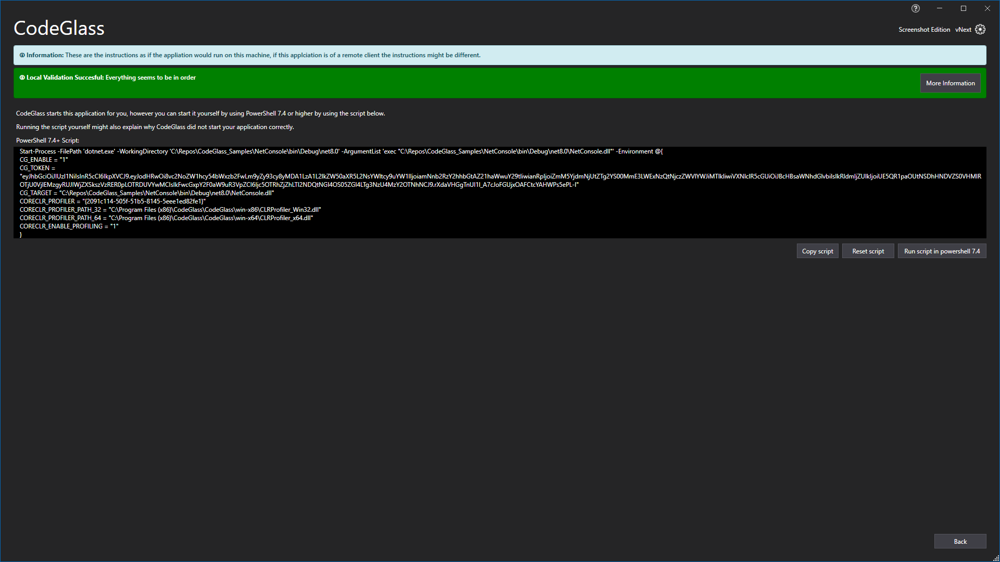
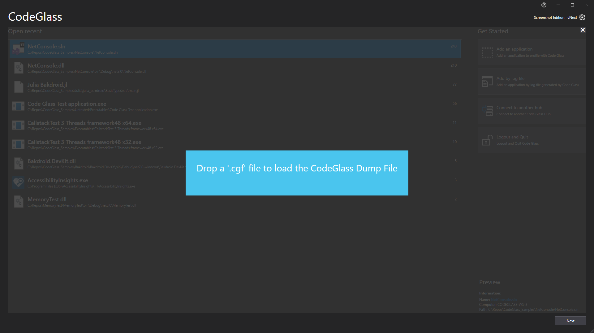

# Application Instances

In this window you can see all the instances of an application that you started since the [CodeGlass Hub](../../features/CodeGlassHub.md) started. Keep in mind that an instance only exists for as long as the hub is running. If you close or restart the hub the instances are removed. If an instance is really important consider making a [snapshot](../ApplicationInstanceDockWindow/Toolbar.md#snapshots).

To view the [profiled instance](../ApplicationInstanceDockWindow.md), you can double click on any of the instances or press the "Open" button in the bottom right.

## Starting a New Instance
To start a new instance, you can press the "Start Integration" button. After pressing this button a new instance is started and a new [application instance window](../ApplicationInstanceDockWindow.md) opens.

### Visual Studio Integration
If you press the "Start Integration" button for a [Visual Studio solution](../../features/supportedruntimes.md#visual-studio-solution), instead of opening an application instance window, it opens a new instance of Visual Studio. To start profiling, you just press the run button in Visual Studio like you would normally do. After starting your application like that, a new instance is automatically added to CodeGlass.

## Start Instructions

Sometimes starting a new instance using the "Start Integration" button does not work for your use case. The can be because you want to run you application using a [JetBrains Editor](../../features/JetbrainsEditors.md) or if you want to run your application from a console. In these cases you can press the "Start Instructions" button. This opens a new window that shows all the information that you need to start your application and add it's instance to CodeGlass. 

The window for now only shows the command as a PowerShell command. If you need to run your application using a different console, you can just copy the environment variables.

At the top of this window you also see a status bar. If everything is correct it bar is green. If something is misconfigured, this bar is orange or red. Pressing the "More Information" button gives you more information about what was right but more importantly what went wrong.

## Add Running Application
In the future we want to support attaching CodeGlass to a running application. This is not yet possible, but we are planning on adding this in the future. See this [roadmap](../../Roadmap/AttachToRunningApplication.md) item for more information.

## Loading Snapshots
On this window you can also add [profiling snapshots](../../features/ProfilingSnapshots.md). You can do this by pressing the "Add by log file" button, or dragging a ".cgf" file into the window.

Uploading the file will add a new instance. If you selected a log file from a different application, it will not be added to this application but it will be added to the correct application.

## Remove application

If you want to remove the current application, you can press the "Remove Application" button. This opens the confirmation window as seen in the screenshot above. When you press "Yes" your application is not actually removed yet. It is first archived and is only removed after you restart the hub. This is done to make sure that there is no unexpected behavior when you remove the application and there was still a profiler attached, or someone was connected to the same hub remotely.

## Application Settings
To change the settings specific to this application, you can press the "Applications Settings" button. This opens a new window where you can change the settings that should be used for starting a new instance. Instances that are already running are not affected by changes to these settings. More information about these setting can be found [here](../ApplicationSettingsWindow.md).

<!-- # Application Breadcrumbs: 
- [Splashscreen](../Splashscreen.md) / [Main Menu - Applications](application.md) / -->

# See Also:
 - [Main Window ](../mainwindow.md)
 - [Applications ](application.md)
 - [Client and User Settings](../clientusersettingswindow.md)
 - [Application Settings](../ApplicationSettingsWindow.md)