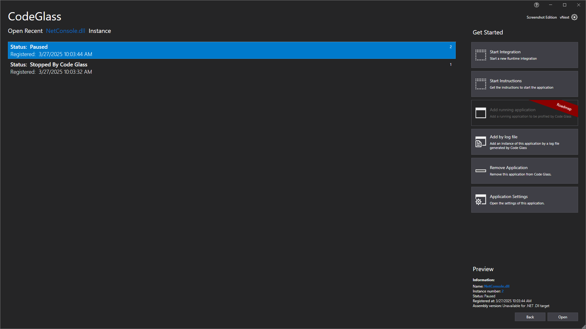

# Application Instances

On this view you see all the instances that were started since the [Code Glass Hub](../../features/CodeGlassHub.md) started.
You can [view the profiled instance](../ApplicationInstanceDockWindow.md)  by double clicking on them or pressing on the "Open" button on the bottom right.

From this view it is also possible to [start a new instance](../ApplicationInstanceDockWindow.md), [Remove the current application](#remove-application) and open the [Application Settngs](../ApplicationSettingsWindow.md)

You can also add an Application by the log file you created with the [Profiling Snapshots](../../features/ProfilingSnapshots.md) by pressing the "Add by log file" button.
If the new instance does not show up make sure that you used a log file from this application, you can check the [applications](application.md) to be sure.

You also see the placeholder button for [Roadmap - Attach To Running Applications](../../Roadmap/RunningApplication.md)

# Remove application

When you press the "Remove Application" button you will get this Confirmation window.

This window states that the application will first be archived and removed after the [Code Glass Hub](../../features/CodeGlassHub.md) restarts.  
This is to ensure data integrety, the full removal of the application data and prevent unexpected behaviour if others are logged in into the same Hub and profiling that application.

# Application Breadcrumbs: 
- [Splashscreen](../Splashscreen.md) / [Main Menu - Applications](application.md) /

# See Also:
 - [Main Window ](../mainwindow.md)
 - [Applications ](application.md)
 - [Client and user settings](../clientusersettingswindow.md)
 - [Application settings](../applicationsettingswindow.md)