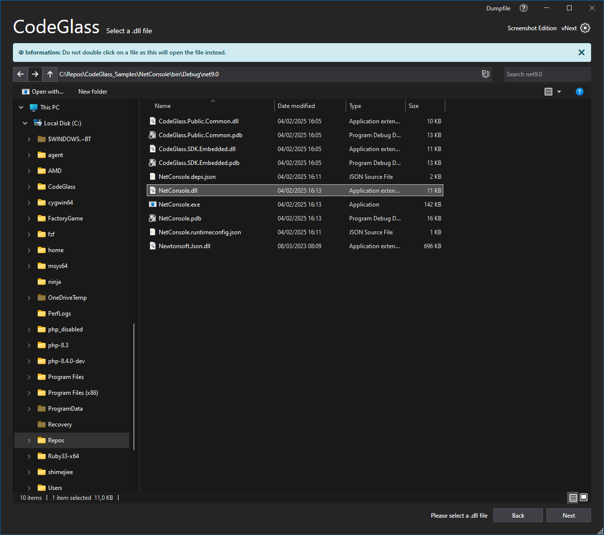
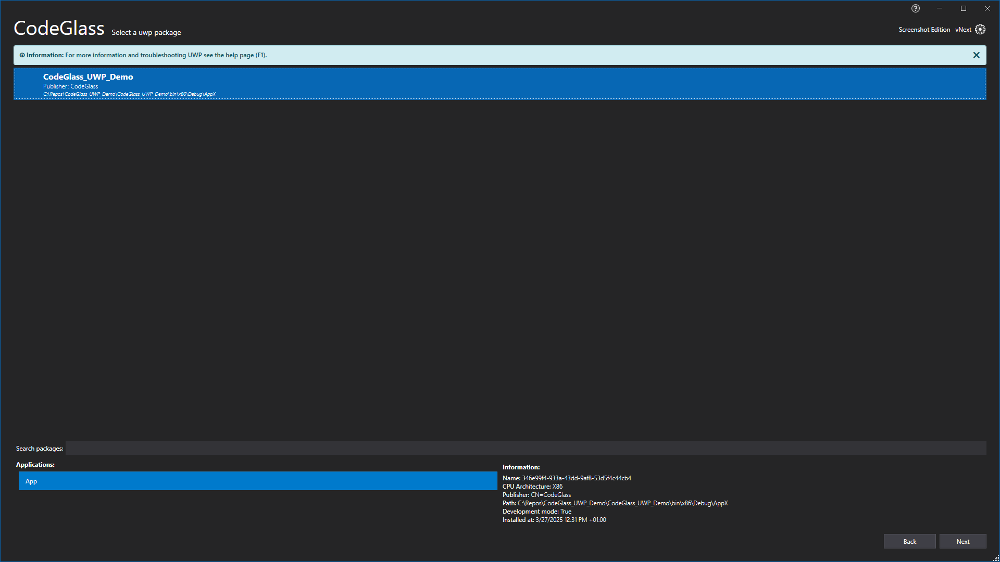

# Add a new Application

Currently we support 2 types of application:

- [File or Folde applications](#file-or-folder) you select by selecting the .exe / .Dll, folder, etc.
- [UWP](#uwp) (Universal Windows Applications) as these cant be selected by File or folder.

Select one by using the buttons in the top middle and follow the instructions in that section.

### File or folder




To add a new application select the file or folder in the explorer like you are used to when using Windows Explorer (again, do not double click your application)
After selecting select the appropriate runtime. Only applicable runtimes will be enabled, you can see why a runtime is unselectable by hovering over the disabled runtimes.

Check [Feature - Supported runtimes](../../features/supportedruntimes.md) for more info and troubleshooting steps if you are unable to select a runtime. 

After selecting the runtime press "Add Application" button in the lower right and you will be brought to the [Application Instance](applicationInstance.md) of the added application

Take note of for .Net Core and .Net 5 it allows you to select a .Exe File, it will run the .DLL instead.

### UWP




You can select an UWP package in the Middle right, after selecting a package you have to select the application in that package, as UWP packages can contain multiple apps.

After selecting the application select the "Universal Windows Platform" runtime and press on "Add Application" button on the bottom right.

Check [Feature - Supported runtimes - UWP](../../features/supportedruntimes.md#uwp) for more information and troubleshooting steps if you are unable to select the Universal Windows Platform Runtime and hovering over it does not give you an answer why.

# Application Breadcrumbs: 
- [Splashscreen](../Splashscreen.md) / [Main Menu - Applications](application.md) /

# See Also:
 - [Main Window ](../mainwindow.md)
 - [Applications Tab](application.md)
 - [Feature -Supported runtimes](../../features/supportedruntimes.md)
 - [Client and user settings](../clientusersettingswindow.md)
 - [External - .Net Native Toolchain](https://docs.microsoft.com/en-us/dotnet/framework/net-native/)

