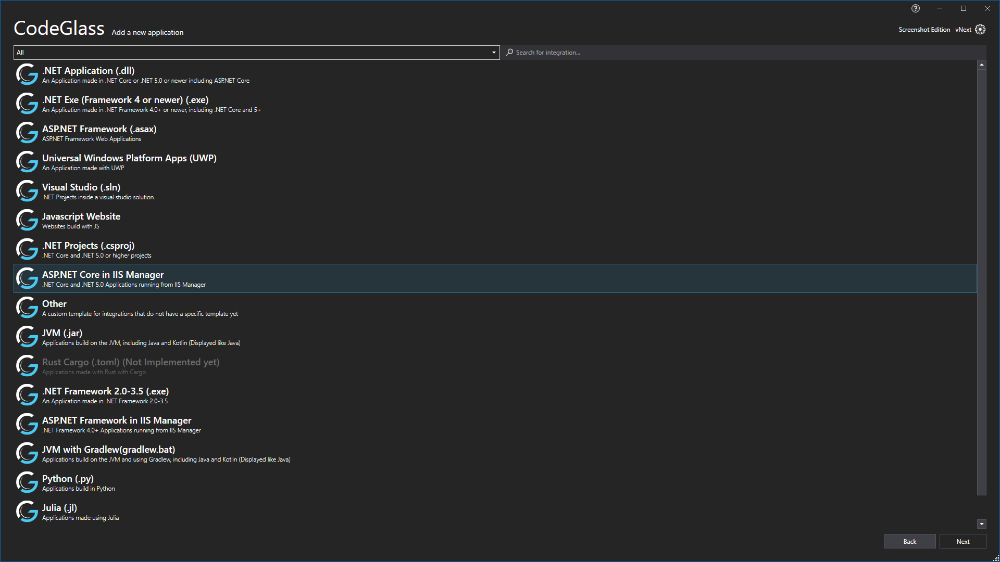

# Add a new Application

Currently CodeGlass supports a multiple different runtimes and applications types. In this screen you can select the runtime or the application type that you want to add.
Select one by clicking on it and following the instructions in that section.

## File or Folder

Most applications that you try to add will bring you to this file explorer screen. Here you can navigate your file system to find the application that you want to add.




To add a new application select the file or folder in the explorer like you are used to when using Windows Explorer (again, do not double click your application).

Check [Feature - Supported Runtimes](../../features/supportedruntimes.md) for more info and troubleshooting steps if you are unable to select a runtime. 

After selecting the runtime press the "Next" button in the lower right and you will be brought to the [configuration screen](#configuration-screen).

Note that of for .Net Core and .Net 5 it allows you to select a .Exe File, it will run the .DLL instead.

## UWP



Here you can select an UWP package in the middle right, after selecting a package you have to select the application in that package, as UWP packages can contain multiple apps.

After selecting the application press on "Next" button on the bottom right. This will bring you to the [configuration screen](#configuration-screen).

Check [Feature - Supported runtimes - UWP](../../features/supportedruntimes.md#uwp) for more information and troubleshooting steps if you are unable to select the Universal Windows Platform Runtime and hovering over it does not give you an answer why.

## Julia
When adding a Julia application, you might want to profile your code in a REPL instead of just profiling a Julia file that you mode. To add a REPL make sure that you do NOT select a file or folder in the file or folder selection screen, but instead just press next. In the configuration screen give your application a display name and leave the location empty. Now press the "Create" button to add the REPL as an application in CodeGlass.

## Configuration Screen

This configuration screen is the final step into adding a new application. Here you can preview the path to your application one last time and change the display name of your application if needed.

When you are done with that, you can press the "Create" button. This will bring you to the [application instances view](applicationInstance.md) of the added application.

# Application Breadcrumbs: 
- [Splashscreen](../Splashscreen.md) / [Main Menu - Applications](application.md) /

# See Also:
 - [Main Window ](../mainwindow.md)
 - [Applications Tab](application.md)
 - [Feature -Supported runtimes](../../features/supportedruntimes.md)
 - [Client and user settings](../clientusersettingswindow.md)
 - [External - .Net Native Toolchain](https://docs.microsoft.com/en-us/dotnet/framework/net-native/)

